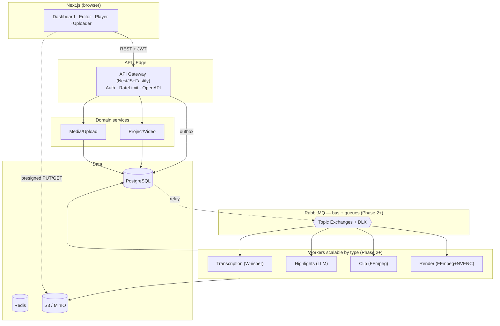

# DESIGN.md — ClipLab Architecture

Master architecture document. Companions:
[`docs/ROADMAP.md`](./docs/ROADMAP.md) · [`docs/COST.md`](./docs/COST.md) ·
[`docs/iterations/`](./docs/iterations/).

---

## 1. Vision

A product equivalent to OpusClip, production-ready and prepared to scale to
millions of processed videos. Core value path:

```
upload → transcribe → detect highlights → cut clips → caption → export
```

Built as **vertical slices**: each phase lights up a real link of the pipeline
and leaves the product working E2E.

---

## 2. Stack and rationale

| Layer | Technology | Why |
|---|---|---|
| Frontend | Next.js, React, TypeScript, Tailwind | Standard, SSR/streaming, ecosystem |
| Backend | **NestJS on the Fastify adapter** | Nest's structure/DI/modules + Fastify's performance; native microservice transport; auto-generated OpenAPI |
| Data | PostgreSQL + **Prisma** | Source of truth; versioned migrations and types |
| Cache/ephemeral | Redis | Rate limiting, locks, job state, WebSocket pub/sub |
| Messaging | **RabbitMQ now; Kafka as a future extension** | Early load is job orchestration (a work-queue with ack, priority, retries, DLQ) — RabbitMQ fits. Kafka enters when high-volume event streaming / analytics / replay appear |
| Storage | S3-compatible (MinIO in dev) | Direct presigned multipart uploads |
| Video | FFmpeg + GPU/NVENC (render) | Deterministic, specialized |
| AI | Whisper (transcription) · Claude LLM (reasoning) · embeddings (search) | Right tool per task |
| Deploy | Docker + K8s (only when truly needed) | K8s only when we must autoscale GPU workers independently |

### NestJS + Fastify (not "one or the other")
They are different layers: NestJS is the application framework, Fastify the HTTP
server. We use `@nestjs/platform-fastify` → Nest's structure with Fastify's
performance. The boilerplate cost is paid once; the benefit (consistency across
services/workers, contracts, messaging transport) scales per phase.

### RabbitMQ vs Kafka
| Need | RabbitMQ | Kafka |
|---|---|---|
| Work queue with per-message ack/nack | ✅ | ⚠️ emulated |
| Retries + DLQ | ✅ | ⚠️ manual |
| Priority, TTL, routing | ✅ | ❌ |
| Backpressure with slow workers (GPU render) | ✅ | ⚠️ |
| Massive throughput / replay / event sourcing | ⚠️ | ✅✅ |

Decision: **RabbitMQ as event bus + work queue** from Phase 2; **Kafka in
parallel** when volume/analytics justify it (it doesn't replace RabbitMQ).

---

## 3. Event-driven architecture



**Principles:**
1. Synchronous API, asynchronous processing (202 + jobId; heavy work in workers).
2. Independent workers scalable by type (GPU render scales differently from LLM).
3. Domain events as the glue; state always reflected in Postgres.
4. **Idempotency + DLQ by design**; each consumer deduplicates by `eventId`.

### Transactional Outbox
Events are persisted to `OutboxEvent` in the **same transaction** that mutates
aggregate state → avoids the dual-write problem (DB vs broker). A relay
publishes pending ones to RabbitMQ.

### Event chain (built per phase)
```
VideoUploaded → TranscriptGenerated → HighlightsDetected →
ClipGenerated → ClipRendered → ExportCompleted
```
Contract per event: name, producer, consumers, payload, guarantees
(at-least-once), idempotency (`eventId`), retries (backoff), DLQ.

---

## 4. AI cost efficiency (functional requirement)

Summary; detail in [`docs/COST.md`](./docs/COST.md).

- **The LLM never receives the video**: video → audio → transcription → segmentation → LLM.
- **The LLM only reasons**. Cuts, timestamps, formats, silences, reframing,
  concatenation, render, metadata → algorithms/FFmpeg/specialized models.
- **Hierarchical pipeline**: Whisper → chunks (2–3 min) → parallel local
  analysis (Haiku) → algorithmic ranking/dedup → top candidates → global rerank (Sonnet).
- **Reduce context** before invoking (drop silences, filler words, repetition).
- **Cache + persist** every AI artifact (model, prompt/content hash, cost,
  version) → reuse and incremental reprocessing.
- **Structured JSON outputs**, prompt caching, and the Batch API to minimize cost.
- Goal: LLM as a **small fraction** of total cost (Whisper/GPU render dominate).

### Provider-agnostic AI (generic registry, env-configurable per process)
AI is consumed through vendor-agnostic interfaces (`apps/worker/src/ai/llm` and
`.../transcription`) plus a **provider registry** (`ai/registry.ts`). Two kinds —
`anthropic` (native) and `openai` (OpenAI-compatible) — back a set of named
presets (`deepseek`, `kimi`/`moonshot`, `qwen`, `groq`, `openrouter`, `together`,
`ollama`, `openai`, `anthropic`); any other name is treated as a custom
OpenAI-compatible endpoint via per-process `<PROCESS>_BASE_URL` + `_API_KEY`
(covers self-hosted / ngrok / vLLM). Each process (transcription, local per-chunk,
global rerank) selects provider + model independently, so vendors can be mixed.
Switching vendor/model is a variable change, not a code change; a new preset is
one line in the registry. Missing config fails the job non-retryably with a clear
reason. See [`CLAUDE.md`](./CLAUDE.md) → AI providers.

---

## 5. Data model (Phase 1–3)

Entities: `User 1—N OAuthAccount`, `User 1—N Video`, `User 1—N RefreshToken`,
`Video 1—1 Upload`, `Video 1—1 Transcript`, `Video 1—1 HighlightSet`,
`OutboxEvent`. Video states: `UPLOADING → PROCESSING → READY | FAILED`. Full
schema in [`packages/db/prisma/schema.prisma`](./packages/db/prisma/schema.prisma).

Versioning: versioned Prisma migrations; in production only additive/compatible
changes (expand/contract), never `DROP` in the same release.

---

## 6. Cross-cutting concerns

- **Security**: Argon2id, short JWT access + rotated refresh with reuse
  detection, Google OAuth, owner-based authorization (IDOR → 404), Redis rate
  limiting, private buckets, short-TTL presigned URLs, Zod validation at the
  edge, secrets out of the repo (validated env).
- **Observability**: JSON logs (pino, no secrets), Prometheus metrics,
  OpenTelemetry tracing, Grafana dashboards, alerts, `/health/live` +
  `/health/ready`, SLO/SLI/KPI per iteration.
- **Scalability**: stateless API (the binary never traverses it → scales
  horizontally), workers scalable by type, cursor-based listing, `userId` indexes.
- **Deployment**: multi-stage Docker, CI/CD (install → migrate → typecheck →
  build), expand/contract migrations, image rollback, feature flags, rolling update.

---

## 7. Roadmap

See [`docs/ROADMAP.md`](./docs/ROADMAP.md). Phases:
1. **Ingestion** (auth, multipart upload, metadata, player) — done
2. Transcription (Whisper + RabbitMQ) — done
3. Highlight detection (hierarchical LLM) — done
4. Clip generation (FFmpeg + 9:16 reframe)
5. Animated captions
6. Export & download
