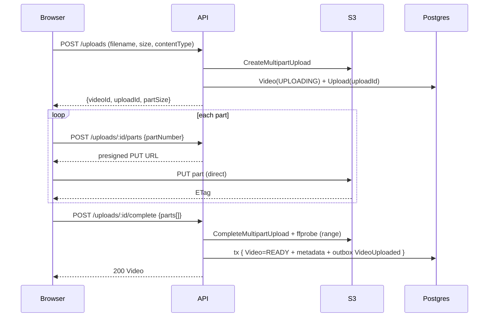

# Iteration 1 — Phase 1: Video ingestion

**Objective:** the user registers/logs in, uploads a long video (up to 2 GB)
with resumable upload, the system extracts real metadata (ffprobe), and views
and plays it in the dashboard. All E2E, no mocks.

> §14 AI cost: this phase **uses no LLM or Whisper** → **$0/video**. Token-based
> cost analysis starts in Iteration 2.

**Status:** done and verified E2E.

---

## 1. PRD

**Problem:** no reliable ingestion → no product. Large videos (200 MB–2 GB),
unstable networks; uploading through the API would saturate it. → direct upload
to storage, resumable and authenticated, with metadata usable downstream.

**User stories**
- US-1 register/log in → private library.
- US-2 sign in with Google.
- US-3 upload a large video without timeout and see progress.
- US-4 resume an interrupted upload without starting over.
- US-5 see my videos with metadata and play them.
- US-6 delete a video.

**Acceptance criteria**
- Registration rejects duplicate email and password < 10 chars; Argon2id.
- Login → 15-min JWT access + rotated 30-day refresh (httpOnly cookie).
- Google OAuth creates/links by verified email.
- 2 GB upload without timeout; 8–16 MB parts; per-part retry; resumable.
- ffprobe extracts `duration, width, height, fps, codec, bitrate, container`;
  on failure → `FAILED` + reason + cleaned S3 object.
- Dashboard lists only the user's videos (cursor); player via short-lived signed URL.
- Delete removes S3 object + row (and aborts pending multipart).

**Edge cases:** network drop (resumable), double `complete` (idempotent),
non-video/corrupt file (FAILED), missing parts (409), refresh-token reuse
(invalidates family), abandoned multipart (S3 lifecycle), quota exceeded (402).

**Metrics:** upload success ≥ 99%; p95 probe→READY < 5 s; p95 API (non-upload)
< 200 ms; 0 orphan objects.

---

## 2. Technical design

- **API** signs S3 URLs, orchestrates the upload lifecycle, runs ffprobe and
  writes the outbox. The binary **never** goes through the API.
- **Synchronous ffprobe** at `complete`, reading only remote headers (range,
  10 s timeout). If p95 rises, it moves to a worker in Phase 2.
- **Outbox** `VideoUploaded` in the same transaction that sets `READY`. No
  consumer in Phase 1 (a real record, not a stub); relay in Phase 2.
- **Auth**: short JWT access + rotated refresh with reuse detection; Argon2id.

**Tradeoff:** synchronous ffprobe couples `complete` latency to S3, acceptable
because it reads only headers; deferred to a worker if needed.

---

## 3–4. Diagrams

Upload flow:

Components: `Web → API (Auth·Upload·Video·Probe·Outbox) → {S3, Postgres, Redis}`.

---

## 5. Data model

`User 1—N OAuthAccount | Video | RefreshToken`, `Video 1—1 Upload`, `OutboxEvent`.
States: `UPLOADING → PROCESSING → READY | FAILED`. Full schema in
[`packages/db/prisma/schema.prisma`](../../packages/db/prisma/schema.prisma).
Key indexes: `Video(userId, createdAt desc)`, unique `Video.storageKey`,
unique `RefreshToken.tokenHash` + `familyId`, `OutboxEvent(publishedAt, createdAt)`.

---

## 6. API (contracts)

OpenAPI at `/docs` (Swagger). Phase 1 endpoints:
`POST /auth/register|login|refresh`, `GET /auth/oauth/google/callback`,
`POST /uploads`, `POST /uploads/:id/parts`, `POST /uploads/:id/complete`,
`POST /uploads/:id/abort`, `GET /videos`, `GET /videos/:id`,
`DELETE /videos/:id`, `GET /videos/:id/playback-url`.
Zod schemas in [`packages/contracts/src/api.ts`](../../packages/contracts/src/api.ts).
Uniform error `{ error: { code, message, details? } }`.

---

## 7. Events

`VideoUploaded` — Producer: API (`complete`). Consumers: none in Phase 1 →
Transcription (Phase 2). Payload in
[`packages/contracts/src/events.ts`](../../packages/contracts/src/events.ts).
Guarantees: at-least-once (outbox+relay), idempotency by `eventId`, retries with
backoff (Phase 2), DLQ `video.dlq` (Phase 2).

---

## 8. E2E flow

register → dashboard → select file → `POST /uploads` (validates quota, creates
multipart + Video UPLOADING) → sign & PUT each part directly to S3 (manifest in
localStorage to resume) → `complete` → ffprobe → tx (READY + metadata +
`storageUsed +=` + outbox) → dashboard shows "Ready" → `playback-url` signs GET
→ `<video>` plays from S3. Delete aborts multipart, removes object and row,
decrements `storageUsed`.

---

## 9. Test plan

- **Unit:** Zod validators, Argon2id, refresh rotation/reuse, partSize calc, ffprobe parser.
- **Integration (testcontainers pg+minio):** full upload cycle, quota (402),
  missing parts (409), double complete (idempotent), corrupt file (FAILED+cleanup),
  per-user isolation (404).
- **Contract:** responses validated against OpenAPI.
- **E2E (Playwright):** register → upload → "Ready" → play → delete; simulate drop and resume.
- **Performance (k6):** 50 concurrent 200 MB uploads, p95 sign < 200 ms, success ≥ 99%.
- **Smoke:** health, register throwaway, sign 1 part, complete, delete.

---

## 10–13. Cross-cutting

- **Observability:** JSON logs (no tokens/URLs), metrics
  (`upload_completed_total`, `probe_duration_seconds`, `outbox_pending_total`),
  OTel tracing, dashboards, alerts (`upload_failed_ratio>2%`, `probe_p95>8s`,
  `api_5xx>1%`), `/health/live|ready`. SLO 99.5% API, 99% uploads.
- **Security:** Argon2id, JWT+rotated refresh, owner-based authorization (404),
  Redis rate limiting, private bucket + short-TTL presigned + fixed Content-Type,
  restricted CORS, ClamAV in ingestion before READY, validated env, OWASP
  (IDOR, injection, SSRF, helmet, CSRF).
- **Scalability:** stateless API (the binary doesn't traverse it), stateless
  signing, client uploads parts in parallel, cursor-based listing. ffprobe →
  worker if p95 is high.
- **Deployment:** multi-stage Docker (api includes ffmpeg), CI (install → migrate
  → typecheck → build), expand/contract migrations, image rollback, flags
  (`oauth_google_enabled`, `virus_scan_enabled`), rolling update with readiness.

---

## 14. Definition of Done

☐ Auth email+Google · ☐ Resumable multipart upload E2E · ☐ ffprobe + states ·
☐ Dashboard + player · ☐ Delete with S3 cleanup · ☐ Migrations · ☐ Outbox
`VideoUploaded` · ☐ Unit+Integration+Contract+E2E+Perf+Smoke · ☐ Logs/metrics/
tracing/alerts · ☐ Health checks · ☐ Rate limit + authorization · ☐ ClamAV ·
☐ CORS/private bucket/secrets · ☐ OpenAPI + client · ☐ Responsive+accessible UI ·
☐ Docker+CI+rollback · ☐ Orphan reconciliation · ☐ QA · ☐ Product.

## 15. Deliverables

PRD · technical design · Mermaid diagrams · Prisma schema + migration · OpenAPI ·
`VideoUploaded` contract · E2E flow · test plan · observability · security ·
scalability/deployment · DoD checklist · monorepo structure.
